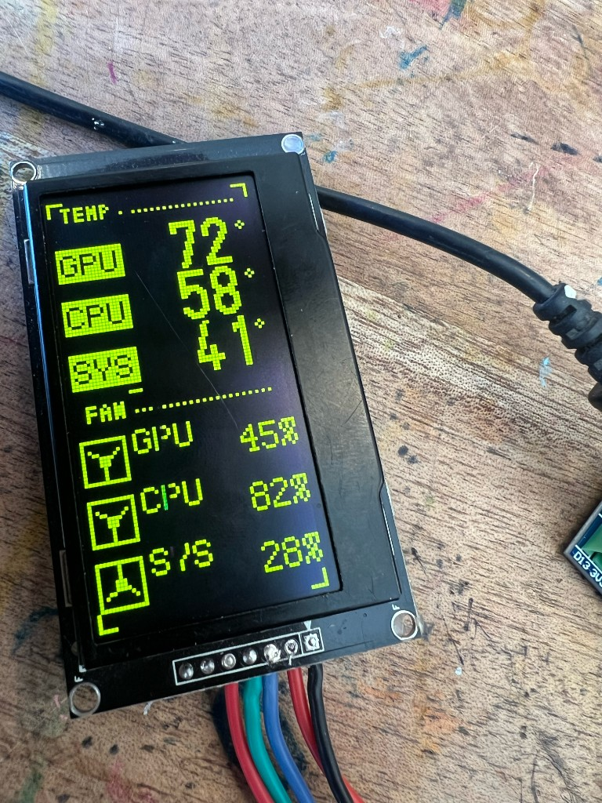

# OLED System Monitor

A portrait system monitor on a 2.42" OLED, driven by an Arduino Nano. Temperatures sit on top. Three short fan bars sit under that. GPU and CPU load sit on the bottom.

`host/oled-monitor.py` runs on the Linux machine and feeds those readings over the serial port. The sketch draws whatever arrives. If the host goes quiet for 5 seconds, the glass blanks instead of freezing the last numbers.



That photo is the earlier screen. The sketch for it is `nano-oled/saved/temps-fans.cpp`. Copy it over `nano-oled/src/main.cpp` to build it again. It expects six numbers, so drop `gpuUse` and `cpuUse` from the host before you flash it.

## Parts

* [2.42" 128x64 SSD1309 OLED](https://s.click.aliexpress.com/e/_c3g9KWrj). Yellow on the temperature half, blue-green on the fans. I2C on A4/A5.
* [Arduino Nano](https://s.click.aliexpress.com/e/_c2RH7xt7). A CH340 clone is fine. This firmware expects the ATmega328P new bootloader.

You also want a short run of jumper wire. Seven connections.

## Wiring

These boards ship set up for SPI. The silkscreen says `SPI:R4` and `IIC:R3,R5`. For I2C, move the resistor on R4 over to R3, and fit a 0 ohm resistor on R5. CS has to sit on ground or the glass stays blank. Tie the CS pin to GND. You do not need to solder R18.

RES is not tied to VCC. It goes to D8 so the sketch can pulse it. Leave it on the supply and the panel stays black.

| OLED | Nano |
| --- | --- |
| VCC | 5V |
| GND | GND |
| SDA | A4 |
| SCL | A5 |
| CS | GND |
| DC | GND |
| RES | D8 |

DC to ground selects I2C address `0x3C`.

## Build

[PlatformIO](https://platformio.org/). From `nano-oled/`:

```bash
pio run -t upload
```

The board target is `nanoatmega328new`. If upload fails with `not in sync` and your clone is an older one, switch the board in `platformio.ini` to `nanoatmega328`.

Stop the host service before uploading. It holds the serial port.

```bash
systemctl --user stop oled-monitor
```

## Linux host

The partner script is `host/oled-monitor.py`. It needs [uv](https://docs.astral.sh/uv/) and Python 3.12 or newer. uv installs `pyserial` for you. From the repo root:

```bash
uv run host/oled-monitor.py
```

Once a second it writes one line at 115200 baud:

```text
gpuC,cpuC,sysC,gpuFan,cpuFan,sysFan,gpuUse,cpuUse
```

Temperatures are whole degrees. Fan numbers and the two load numbers are percents. On this machine those come from:

| Reading | Source |
| --- | --- |
| GPU temp | `amdgpu` edge |
| CPU temp | `k10temp` Tctl |
| SYS temp | `it8688` temp1, the board thermistor |
| GPU fan | `amdgpu` fan RPM against the max the card publishes |
| CPU fan | `it8688` fan1, 2500 RPM = 100% |
| SYS fan | `it8688` fan2, 2500 RPM = 100% |
| GPU load | `amdgpu` `gpu_busy_percent` |
| CPU load | `/proc/stat`, busy time since the last sample |

A fan that beats its max is still over 100 in that line, so you can see the cap is low. Load stays in 0 to 100. The caps and the hwmon names sit at the top of the script.

The port is `/dev/serial/by-id/usb-1a86_USB_Serial-if00-port0`, the CH340 with no serial number. Your user needs to be in the `dialout` group. Log out and back in after adding it.

```bash
sudo usermod -aG dialout "$USER"
```

On a lot of desktops, `brltty` grabs a CH340 a few seconds after you plug it in and the serial port vanishes. If `ttyUSB0` shows up and then disappears, stop that service:

```bash
sudo systemctl disable --now brltty
```

`host/oled-monitor.service` starts the script at login. `ExecStart` points at this checkout. Change that path if you cloned the repo somewhere else, then:

```bash
mkdir -p ~/.config/systemd/user
ln -sfn "$PWD/host/oled-monitor.service" ~/.config/systemd/user/oled-monitor.service
systemctl --user daemon-reload
systemctl --user enable --now oled-monitor
```

## What's on the screen

GPU, CPU, and SYS temperatures are degrees. Under FAN, three bars labeled G, C, and S are the GPU, CPU, and system fan. An empty bar is stopped. A full bar is 100%. One pixel past the end of the track means that fan is over its cap. GPU and CPU load are percents along the bottom. A small block walks the dotted line after FAN. With no line for 5 seconds the panel clears, which is what you see after shutdown.
